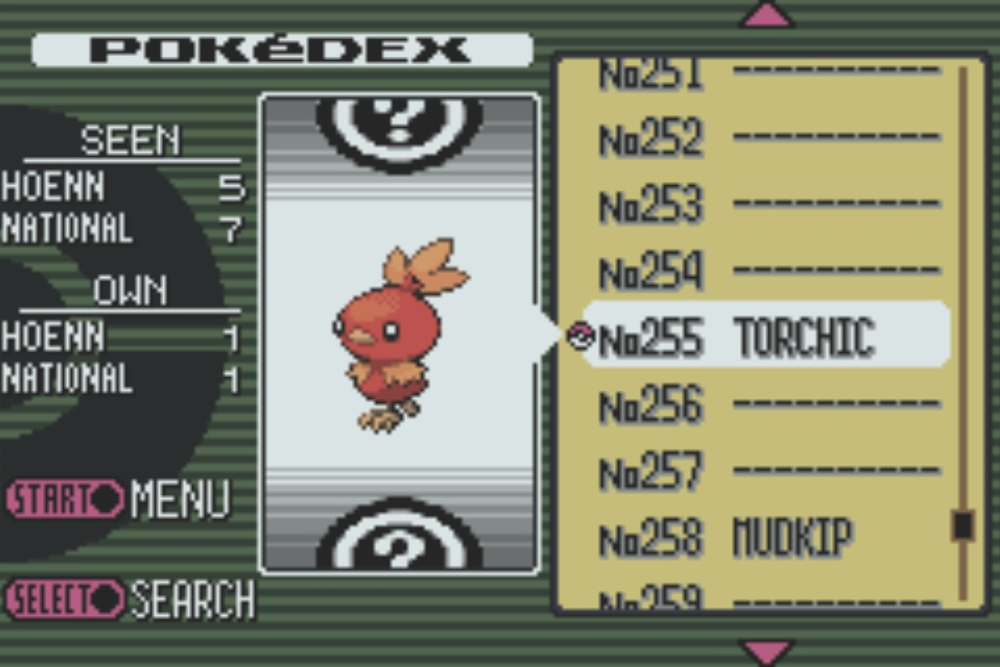
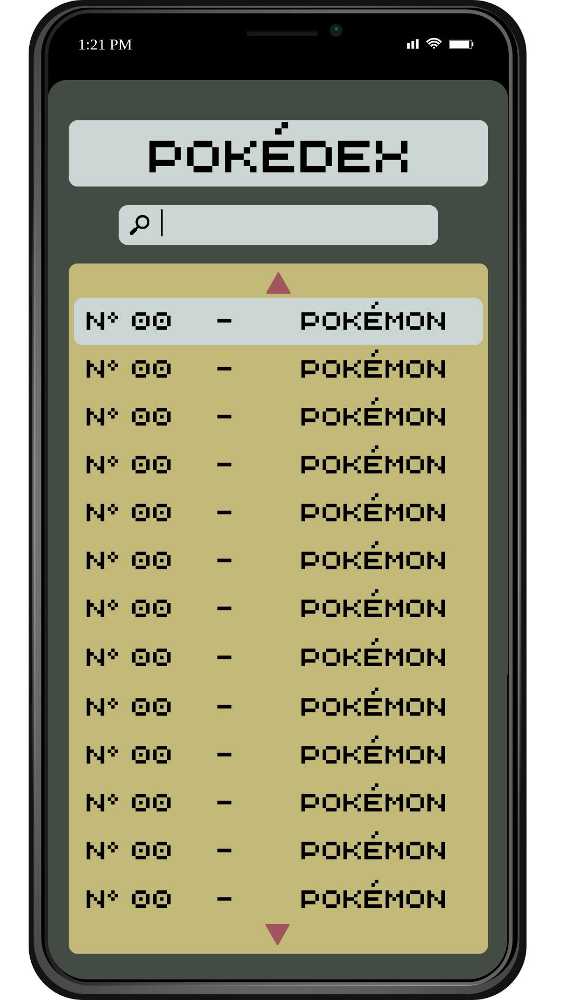
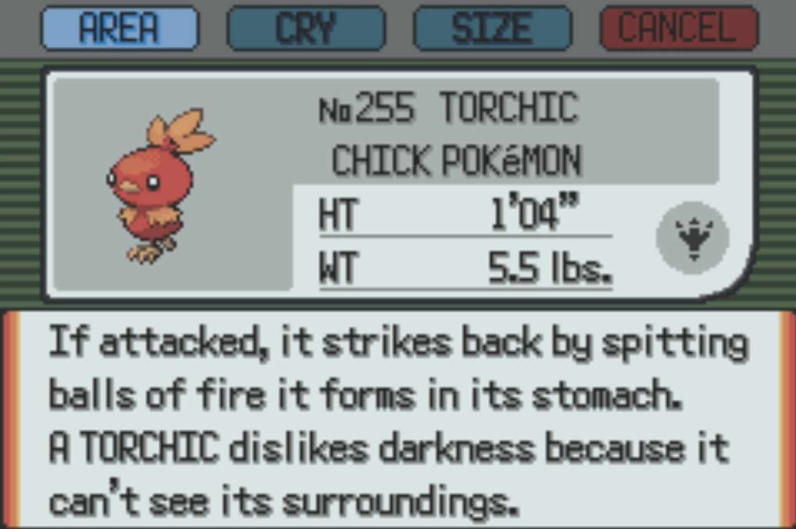
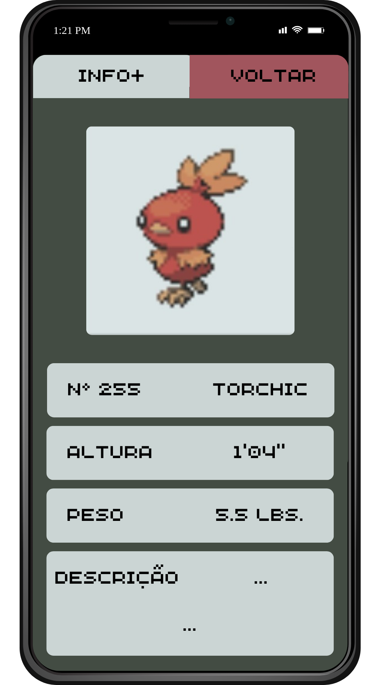
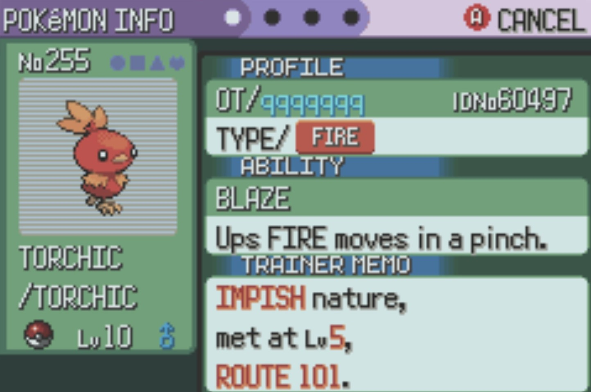
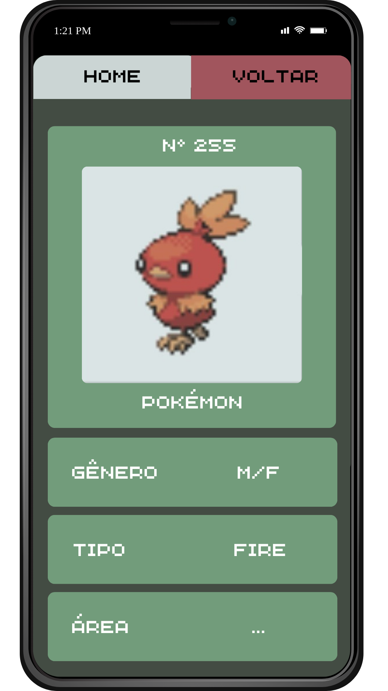

#  Projeto Pokédex 

## Índice
1. <a href="#introdução">Introdução</a>
2. <a href="#funcionamento-do-projeto-e-esboço-das-telas">Funcionamento do Projeto e Esboço das Telas</a>

    2a. <a href="#tela-01---home">Tela 01 - Home</a>

    2b. <a href="#tela-02---informações-básicas">Tela 02 - Informações Básicas</a>

    2c. <a href="#tela-03---informações-específicas">Tela 03 - Informações Específicas</a>
    
3. <a href="#alunos-responsáveis">Alunos Responsáveis</a>

## Introdução

Pokémon é um jogo criado em 1996 cuja história narra a jornada de uma criança em busca de ser um mestre Pokémon. O mundo Pokémon é um lugar em que seres humanos possuem a capacidade de capturar criaturas chamadas Pokémons, criá-las e treiná-las. Nesse universo vários cientistas buscam documentar tais espécimes cuja origem é bastante desconhecida, para tanto criaram um dispositivo em que a função é coletar informações sobre esses seres que são capturados pelos treinadores Pokémon.

Nosso projeto busca recriar tal dispositivo, a Pokédex, mais especificamente inspirado na do jogo "Pokémon Emerald" (3ª geração da franquia). Para isso, usaremos a API "PokéAPI" e com ela pegamos informações como nome, tipo, altura, peso, pegada, local onde é encontrado, e outros.

## Funcionamento do Projeto e Esboço das Telas

A estética como dito anteriormente é inspirada em "Pokémon Emerald", e ainda exibiremos junto a dados básicos dos Pokémons que são apresentados em outra aba do jogo original.

### Tela 01 - Home

Ao entrar no aplicativo a primeira tela com que o usuário se depara contém:
- o nome da aplicação "Pokédex",
- a imagem do Pokémon selecionado, 
- opção de pesquisa por nome de Pokémon,
- uma lista - que será uma área de scroll - contendo nome e número referente a todos os Pokémons da API (ou quantos forem possíveis, pois são muitos e prazo é curto);

Quando o usuário clica em um Pokémon será direcionado a uma nova tela (tela 02 - Informações Básicas) com informações básicas.

1. Tela do jogo oficial

2. Projeção para tela da aplicação

### Tela 02 - Informações Básicas

Na tela de informações básicas há as seguintes informações trazidas pela API: 
- Número,
- Nome,
- Aparência (uma imagem do Pokémon), 
- Descrição, 
- Peso, 
- Altura;

Ademais a tela conta com as seguintes opções na parte superior para realizar a troca de tela: 
- Info+ (tela 03 - Informações Específicas),
- Voltar ( para retornar para a tela 01 - Home);

1. Tela do jogo oficial:

2. Projeção para tela da aplicação

### Tela 03 - Informações Específicas

Nesta tela o usuário encontrará novas informações sobre o Pokémon entre elas:
- Número,
- Nome,
- Gênero,
- Tipo, 
- Área onde é encontrado;

Ainda a tela possui as opções na parte superior de troca de tela: 
- Home (tela 01 - Home),
- Voltar ( para retornar para a tela 02 - Informações Básicas);

1. Tela do jogo oficial

2. Projeção para tela da aplicação

## Alunos Responsáveis

- Evelyn Badoco da Silva
- Maria Fernanda Correa Lima
- Miguel de Melo Souza
- Sophia Agnes de Machado Ferreira